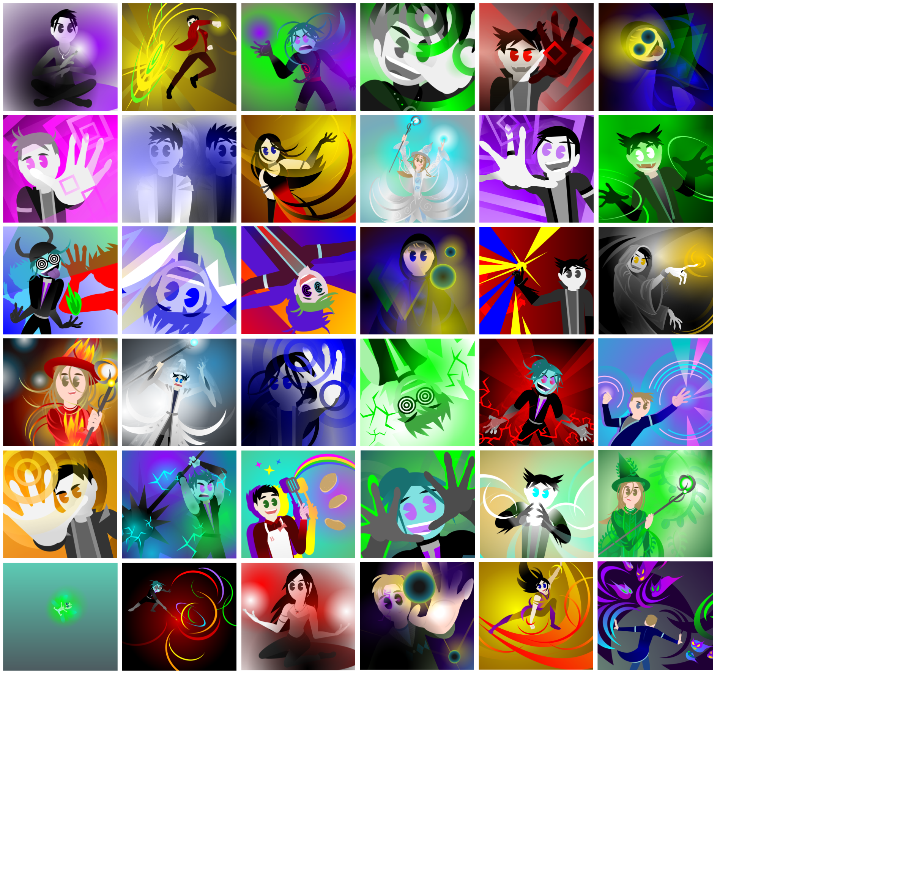

## Magic Fight: the app!

Long ago, I made a bunch of dumb character art in Google Drawings.

Equally long ago, I wrote a Python command line game featuring these characters. (Do not ask me about their universe; I will talk your ears off.)

And now there's AI.

So I asked Claude to please use that 'serverless' buzzword we keep seeing all over the place
and convert my original game (and art) into a web app. With, like, fancy JavaScript so everyone can throw polygons at each other.

